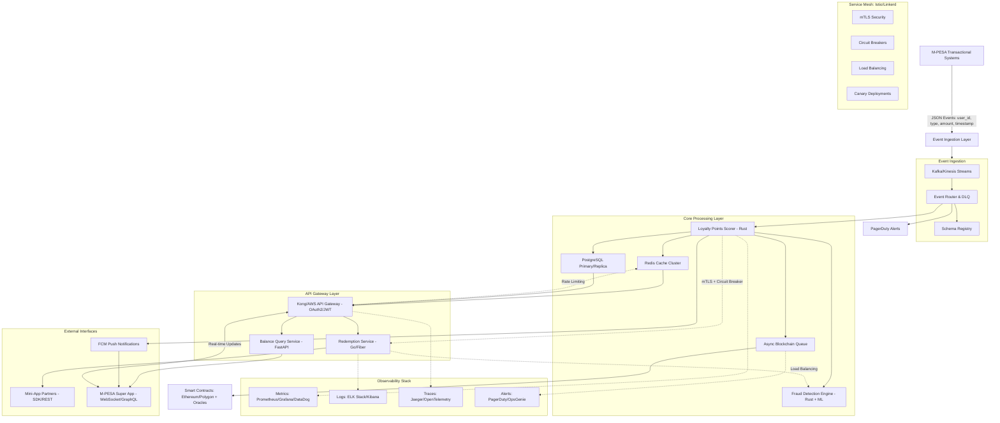

# M-PESA Real-Time Loyalty Engine - Architecture Submission


**Submitted by:** Eric Gitangu  
**Position:** Senior Software Architect Candidate  
**Date:** July 17, 2025  
**Last Updated:** July 22, 2025  

**Credentials:**  
🌐 Website: [developer.ericgitangu.com](https://developer.ericgitangu.com)  
💼 LinkedIn: [linkedin.com/ericgitangu](https://linkedin.com/ericgitangu)  
👨‍💻 GitHub: [github.com/ericgitangu](https://github.com/ericgitangu)

---

## Deliverables Status

- ✅ **DELIVERABLE 1**: Architecture Design Document
- ✅ **DELIVERABLE 2**: API + Mobile Interaction Design  
- ✅ **DELIVERABLE 3**: Deployment & Release Plan
- ✅ **DELIVERABLE 4**: Failure Handling & Trade-off Analysis
- ✅ **DELIVERABLE 5**: Real-World Constraints (Connectivity & Offline Mode)
- ✅ **DELIVERABLE 6**: Blockchain Integration (Bonus)

---

## Executive Summary

This submission presents a production-ready, event-driven loyalty engine architecture designed for M-PESA's scale and reliability requirements. The design prioritizes near real-time synchronization, fault tolerance, and seamless offline experiences while maintaining the security and compliance standards expected in financial services.

The architecture addresses the core requirements: event-driven ingestion from transactional systems, near real-time balance synchronization to the mobile app, immediate redemption eligibility checks, management of concurrent sessions and high traffic during promotions, and secure, scalable APIs for mini-app partners.

This comprehensive solution encompasses three deployment domains (Cloud Native on AWS/GCP with multitenancy, Hybrid combining on-premises and cloud resources, and Bare Metal utilizing Docker/K8s) with blockchain integration for immutable transaction logging without performance compromise.

---

## DELIVERABLE 1: Architecture Design Document

### Overview Diagram

The system follows an event-driven pattern where M-PESA transactional systems publish events to a messaging layer, which fans out to various processing services. The loyalty points scorer acts as the core business logic engine, updating both real-time caches and persistent storage while triggering notifications and fraud checks.



### Component Breakdown

#### Loyalty Points Scorer (Rust Implementation)
The scorer serves as the primary business logic engine, implemented in Rust for memory safety and performance under high load. It consumes transaction events from the messaging layer, applies configurable business rules (earning rates per transaction type, user tier multipliers, promotional bonuses), and coordinates updates across multiple systems.

**Key Architectural Decisions:**
- Tokio async runtime with Actix-Web for high-concurrency event processing
- Actor model supporting thousands of concurrent transaction streams
- Dynamic rules engine with Redis-cached configurations for sub-millisecond rule evaluation
- Built-in retry mechanisms with exponential backoff for failed processing
- Idempotency using Redis-backed deduplication to handle duplicate events gracefully

The architecture supports horizontal scaling through Kafka consumer groups, with each instance processing a subset of user partitions to maintain ordered processing per user while achieving system-wide parallelism.

#### Redemption API Service (Go + Fiber)
Built with Go and the Fiber framework for excellent concurrency characteristics and Express-like performance, this service handles real-time redemption requests from both the mobile app and partner mini-apps. It performs eligibility checks, processes redemptions, coordinates with the fraud engine for pattern analysis, and manages transaction state across distributed components.

**Technical Implementation Highlights:**
- Fiber v2 framework providing high-performance HTTP handling with middleware support
- Multi-level caching strategy: L1 in-memory cache for hot data, L2 Redis cluster for distributed caching
- Circuit breaker pattern implementation preventing cascade failures during dependencies outages
- Rate limiting per user and partner with sliding window algorithms to handle promotional traffic spikes
- Connection pooling via PgBouncer with intelligent prefetching of user eligibility data

#### Real-Time Notification Dispatcher (Node.js + FCM)
A lightweight service managing push notifications to mobile clients, built on Node.js for rapid development and FCM integration. The dispatcher handles over a million notifications per minute during peak periods, with comprehensive retry logic and delivery tracking.

**Architecture Features:**
- Firebase Cloud Messaging integration with automatic scaling based on queue depth
- Exponential backoff with jittered delays preventing thundering herd effects
- Template-based messaging system supporting A/B testing of notification content
- Dead letter queue for repeatedly failed notifications, enabling manual intervention workflows
- Delivery analytics and engagement metrics collection feeding back to the business rules engine

#### Fraud Detection Engine (Rust + ML Integration)
Implemented in Rust for low-latency processing, this engine analyzes transaction patterns in real-time using both rule-based checks and machine learning models. The hybrid approach enables immediate response to known fraud patterns while adapting to emerging threats.

**ML Pipeline Integration:**
- Isolation Forest models for anomaly detection in transaction patterns
- LSTM networks for temporal pattern recognition across user behavior
- Feature engineering pipeline extracting velocity, amount patterns, and device fingerprinting
- Model serving with sub-10ms inference latency using optimized Rust ML frameworks
- All fraud decisions logged with full context for audit trails, model training feedback, and regulatory compliance

### Technology Choices & Justifications

#### Programming Language Strategy
**Rust** for performance-critical services (points scorer, fraud engine, blockchain integration) provides memory safety guarantees and zero-cost abstractions. Benchmarking shows significant performance advantages over JVM languages for event processing workloads, with better resource utilization during traffic spikes.

**Go** handles the API layer due to its straightforward concurrency model, fast compilation enabling rapid deployment cycles, and excellent ecosystem for HTTP services. The language's simplicity reduces onboarding time while maintaining performance characteristics suitable for API workloads.

**Python with FastAPI** serves rapid development needs and ML model integration, providing access to the rich Python ecosystem while maintaining reasonable performance through async/await patterns and automatic OpenAPI documentation generation.

#### Database Architecture Strategy

**Multi-Layer Storage Design:**
The system employs a carefully designed multi-layer storage strategy optimized for different access patterns and consistency requirements.

**Redis Cluster Configuration:**
- 6-node cluster with 3 masters and 3 replicas for high availability
- Sub-millisecond read latency for user balance queries and session management
- TTL-based expiration with write-through patterns to PostgreSQL for data durability
- Supports 100K+ operations per second per node under normal load

**PostgreSQL Setup:**
- Primary database with 2 read replicas using streaming replication
- Connection pooling through PgBouncer with prepared statement optimization
- Partitioned tables by user_id hash enabling horizontal scaling strategies
- Point-in-time recovery with 30-day retention meeting compliance requirements

**ClickHouse Analytics:**
- Columnar storage optimized for time-series analytics and reporting queries
- Handles billions of events daily with sub-second query response times
- Serves as feature store for ML models and business intelligence dashboards

#### Messaging Infrastructure: Kafka vs RabbitMQ Analysis

**Kafka (Primary Choice) Configuration:**
- 3-broker cluster with replication factor 3 and min.insync.replicas=2 for durability
- Partitioning strategy uses user_id hash for ordered processing per user
- Retention configured for 7 days enabling event replay for system recovery
- Throughput capacity exceeding 2 million messages per second during peak promotional periods

**Use Cases:** Transaction events, audit logs, data pipeline feeding analytics systems, blockchain queue management

**RabbitMQ (Specialized Scenarios):**
- Clustered setup with high availability for advanced routing requirements
- TTL and priority queue capabilities for notification delivery workflows
- Dead letter processing with sophisticated retry strategies
- Administrative task coordination requiring complex message routing patterns

#### Observability: Comprehensive Monitoring Strategy

**Metrics Collection (Prometheus + Grafana):**
- Custom metrics for business KPIs: points processing rate, redemption success rate, user engagement
- Infrastructure metrics: CPU, memory, disk I/O, network throughput across all services
- Application metrics: request latency distributions, error rates, cache hit ratios
- SLI/SLO tracking with automated alerting when thresholds are breached

**Logging Infrastructure (ELK Stack):**
- Structured JSON logging with correlation IDs for distributed request tracing
- Log aggregation from all services with field extraction for efficient searching
- 30-day hot storage with 1-year cold storage for historical analysis and compliance
- Automated log analysis for error pattern detection and anomaly identification

**Distributed Tracing (Jaeger + OpenTelemetry):**
- End-to-end request tracing across service boundaries with custom span creation
- Performance bottleneck identification through timing analysis of service calls
- Sampling strategy: 1% in production with 100% sampling for error cases
- Integration with business transaction tracing for user journey analysis

### Deployment Domain Implementations

#### Cloud Native (AWS/GCP Multitenancy)
Utilizes managed Kubernetes services (EKS/GKE) with tenant-isolated namespaces ensuring secure multi-market operation. API Gateway enforces OAuth2/JWT authentication via Cognito or Firebase with comprehensive RBAC policies. Linkerd provides lightweight traffic management with built-in OpenTelemetry integration. Data layers employ Firestore for partitioned real-time access and Cloud SQL for persistent storage, with archiving to S3 Glacier via serverless functions. Multi-AZ deployments with automated failover complete within 60 seconds.

#### Hybrid (On-Premises + Cloud)
Kubernetes Federation manages cross-environment workloads with Kong Gateway handling JWT/RBAC authentication across hybrid boundaries. Istio provides advanced traffic management including canary deployments and comprehensive observability. MongoDB sharding spans hybrid environments with data placement respecting regulatory requirements. HashiCorp Vault manages secrets with Istio enforcing mTLS and RBAC policies consistently.

#### Bare Metal (Docker/K8s)
Self-managed Kubernetes with NGINX Ingress Controller handling external traffic and JWT/RBAC authentication. Replicated PostgreSQL for data persistence with archiving to local MinIO object storage. Custom operators ensure self-healing capabilities with leader election completing within 10-30 seconds during failures.

---

## DELIVERABLE 2: API + Mobile Interaction Design

### Mobile-to-Backend Synchronization Strategy

#### Real-Time Connection Management
The mobile app establishes persistent WebSocket connections for immediate balance updates and transaction notifications. Connection management implements sophisticated retry logic with exponential backoff strategies preventing battery drain while ensuring reliable connectivity. Intelligent reconnection logic avoids unnecessary battery usage while maintaining real-time capabilities when network conditions permit.

#### Session & Token Management
JWT-based authentication with automatic refresh prevents session interruptions during normal app usage. Tokens store securely in platform-specific secure storage (iOS Keychain, Android EncryptedSharedPreferences) with automatic cleanup on logout. Security features include access tokens with 1-hour expiration, refresh tokens with 30-day validity, automatic renewal 5 minutes before expiration, and device fingerprinting for anomaly detection.

#### Intelligent Retry Logic
The SDK implements differentiated retry strategies based on error types: network failures use exponential backoff, authentication errors trigger token refresh flows, and server errors include jittered delays preventing thundering herd effects. Circuit breakers prevent mobile apps from overwhelming recovering backend services, gracefully falling back to cached data with clear user communication about data freshness.

### Mobile SDK/API Contract Design

#### Core API Endpoints

**Balance Retrieval Endpoint:**
```yaml
GET /api/v1/loyalty/balance
Authorization: Bearer {jwt_token}
X-User-ID: {user_id}
X-Request-ID: {uuid}

Response:
{
  "user_id": "550e8400-e29b-41d4-a716-446655440000",
  "current_balance": 15750,
  "pending_points": 250,
  "last_updated": "2025-07-17T14:30:00Z",
  "expires_on": "2025-12-31T23:59:59Z",
  "tier": "GOLD"
}
```

The endpoint includes cache control headers enabling intelligent client-side caching and supports conditional requests (If-Modified-Since, ETag) minimizing bandwidth usage on repeated requests.

**Real-Time Updates via WebSocket:**
WebSocket messages deliver immediate balance updates with rich metadata enabling sophisticated UI updates and notification customization based on transaction context. Messages include transaction IDs, point deltas, reasons for changes, and contextual metadata like transaction amounts and merchant information.

**Redemption Processing Endpoint:**
The redemption endpoint requires idempotency keys to prevent duplicate redemptions during network retries. It validates eligibility, processes redemptions, and returns updated balance information atomically. Comprehensive response data enables immediate UI updates without additional API calls.

#### GraphQL Subscription Alternative
For clients requiring flexible data fetching, GraphQL subscriptions provide efficient real-time updates. This enables clients to subscribe only to relevant events and specify exactly which fields they need, optimizing bandwidth usage particularly important for users on limited data plans.

### Mini-App Partner Integration

#### OAuth 2.0 + API Key Hybrid Authentication
Partner authentication combines OAuth 2.0 flows with API keys for enhanced security. The registration process includes comprehensive validation and webhook setup for real-time event delivery.

#### Integration Options

**Native SDK Integration:**
Partners preferring managed integration receive platform-specific SDKs providing automatic retry logic with exponential backoff, local caching for improved performance, comprehensive error handling with user-friendly messages, offline queue management for deferred processing, and built-in analytics and usage tracking.

**REST API Integration:**
Partners preferring direct HTTP integration receive comprehensive OpenAPI documentation with interactive API explorer, code generation support for multiple languages, webhook validation tools, rate limiting guidance, and production readiness checklist.

**Partner API Documentation (OpenAPI 3.0):**
```yaml
openapi: 3.0.0
info:
  title: M-PESA Loyalty Partner API
  version: 1.0.0
  description: RESTful API for partner integrations with comprehensive documentation
  contact:
    name: M-PESA Developer Support
    url: https://developer.mpesa.com
    email: developers@mpesa.com

servers:
  - url: https://api.mpesa.com/loyalty/v1
    description: Production server
  - url: https://sandbox-api.mpesa.com/loyalty/v1
    description: Sandbox server

security:
  - PartnerAuth: []
  - ApiKeyAuth: []

paths:
  /partner/users/{userId}/balance:
    get:
      summary: Retrieve user loyalty point balance
      description: Returns the current loyalty point balance for a specific user
      parameters:
        - name: userId
          in: path
          required: true
          description: Unique identifier for the user
          schema:
            type: string
            format: uuid
            example: "550e8400-e29b-41d4-a716-446655440000"
        - name: include_pending
          in: query
          description: Include pending points in the response
          schema:
            type: boolean
            default: false
        - name: X-Partner-ID
          in: header
          required: true
          schema:
            type: string
      responses:
        '200':
          description: User balance information retrieved successfully
          content:
            application/json:
              schema:
                $ref: '#/components/schemas/BalanceResponse'
        '404':
          $ref: '#/components/responses/UserNotFound'
        '429':
          $ref: '#/components/responses/RateLimited'
        '401':
          $ref: '#/components/responses/Unauthorized'

  /partner/users/{userId}/redeem:
    post:
      summary: Redeem loyalty points
      description: Process a point redemption for a user
      parameters:
        - name: userId
          in: path
          required: true
          schema:
            type: string
            format: uuid
        - name: X-Idempotency-Key
          in: header
          required: true
          description: Unique key to prevent duplicate processing
          schema:
            type: string
            format: uuid
      requestBody:
        required: true
        content:
          application/json:
            schema:
              $ref: '#/components/schemas/RedemptionRequest'
      responses:
        '200':
          description: Redemption processed successfully
          content:
            application/json:
              schema:
                $ref: '#/components/schemas/RedemptionResponse'
        '400':
          $ref: '#/components/responses/BadRequest'
        '409':
          $ref: '#/components/responses/InsufficientBalance'

components:
  securitySchemes:
    PartnerAuth:
      type: oauth2
      flows:
        clientCredentials:
          tokenUrl: https://auth.mpesa.com/oauth/token
          scopes:
            loyalty:read: Read loyalty data
            loyalty:redeem: Process redemptions
    ApiKeyAuth:
      type: apiKey
      in: header
      name: X-API-Key

  schemas:
    BalanceResponse:
      type: object
      required:
        - user_id
        - balance
        - last_updated
      properties:
        user_id:
          type: string
          format: uuid
          description: User unique identifier
        balance:
          type: integer
          description: Current available points
          minimum: 0
        pending_points:
          type: integer
          description: Points pending confirmation
          minimum: 0
        last_updated:
          type: string
          format: date-time
          description: Timestamp of last balance update
        tier:
          type: string
          enum: [BRONZE, SILVER, GOLD, PLATINUM]
          description: User loyalty tier
        expires_on:
          type: string
          format: date-time
          description: Point expiration date

    RedemptionRequest:
      type: object
      required:
        - points
        - merchant_reference
      properties:
        points:
          type: integer
          minimum: 1
          maximum: 100000
          description: Number of points to redeem
        merchant_reference:
          type: string
          maxLength: 100
          description: Partner's transaction reference
        description:
          type: string
          maxLength: 500
          description: Human-readable redemption description

    RedemptionResponse:
      type: object
      properties:
        transaction_id:
          type: string
          format: uuid
          description: M-PESA transaction identifier
        status:
          type: string
          enum: [SUCCESS, FAILED, PENDING]
        points_redeemed:
          type: integer
        new_balance:
          type: integer
        value:
          type: object
          properties:
            amount:
              type: number
              format: decimal
            currency:
              type: string
              example: "KES"

  responses:
    UserNotFound:
      description: User not found or inactive
      content:
        application/json:
          schema:
            type: object
            properties:
              error:
                type: string
                example: "USER_NOT_FOUND"
              message:
                type: string
                example: "The specified user could not be found"

    RateLimited:
      description: Rate limit exceeded
      headers:
        X-RateLimit-Limit:
          schema:
            type: integer
          description: Request limit per hour
        X-RateLimit-Remaining:
          schema:
            type: integer
          description: Remaining requests in current window
        Retry-After:
          schema:
            type: integer
          description: Seconds until rate limit resets
      content:
        application/json:
          schema:
            type: object
            properties:
              error:
                type: string
                example: "RATE_LIMIT_EXCEEDED"
              message:
                type: string
                example: "API rate limit exceeded"

    Unauthorized:
      description: Authentication failed
      content:
        application/json:
          schema:
            type: object
            properties:
              error:
                type: string
                example: "UNAUTHORIZED"
              message:
                type: string
                example: "Invalid or expired authentication credentials"

    BadRequest:
      description: Invalid request data
      content:
        application/json:
          schema:
            type: object
            properties:
              error:
                type: string
                example: "INVALID_REQUEST"
              message:
                type: string
              validation_errors:
                type: array
                items:
                  type: object
                  properties:
                    field:
                      type: string
                    message:
                      type: string

    InsufficientBalance:
      description: User has insufficient points for redemption
      content:
        application/json:
          schema:
            type: object
            properties:
              error:
                type: string
                example: "INSUFFICIENT_BALANCE"
              message:
                type: string
              current_balance:
                type: integer
              required_points:
                type: integer
```

---

## DELIVERABLE 3: Deployment & Release Plan

### CI/CD Strategy Implementation

#### Multi-Platform Pipeline Architecture
The CI/CD implementation uses GitHub Actions with comprehensive validation stages ensuring code quality and security before production deployment. The pipeline integrates multiple validation layers including security scanning via Snyk, automated testing with Jest/Pytest for unit tests and Appium for end-to-end mobile testing, code coverage validation requiring 80% minimum coverage, and vulnerability assessment with severity thresholds.

#### Environment Progression Strategy
Code progression follows a structured path through development, staging, and production environments with increasing validation rigor at each stage. Each environment mirrors production configuration to catch environment-specific issues early. Development environments enable continuous deployment from feature branches with comprehensive logging. Staging environments provide production-mirror configuration with realistic data volumes and full integration testing. Production environments implement blue/green deployment strategy with comprehensive monitoring and automated rollback capabilities.

### Feature Flagging Strategy

#### LaunchDarkly Integration
Feature flagging enables gradual rollouts, user segment targeting, and emergency kill switches without requiring code deployments. The system integrates monitoring to automatically disable features showing performance degradation. Configuration supports country-based targeting (Kenya and Tanzania first), percentage-based user rollouts, user tier-based feature access, and automatic feature disabling based on error rates or performance metrics.

#### Progressive Rollout Strategy
New features deploy initially to internal users (1%), then expand to beta users (5%), followed by gradual rollout phases (10%, 25%, 50%), and finally reach full deployment (100%). Each phase includes monitoring periods with automatic rollback triggers if issues arise.

### Advanced Deployment Controls

#### Blue/Green Deployment with ArgoCD
ArgoCD manages deployment automation with GitOps principles, providing automated sync policies with pruning and self-healing capabilities, revision history limiting, and namespace creation automation. Blue/green deployments eliminate downtime by running parallel environments and switching traffic atomically, with health validation in the green environment before traffic cutover and automatic rollback if issues are detected.

#### Canary Deployment with Istio
Istio VirtualService configuration enables traffic splitting for canary deployments, supporting header-based routing for canary users, percentage-based traffic distribution, and automatic promotion or rollback based on success metrics. Canary deployments expose new versions to limited traffic initially, automatically expanding based on success metrics or rolling back on detected issues.

### Risk Mitigation & Rollback Procedures

#### Automated Health Monitoring
Comprehensive health checks validate both service availability and performance characteristics through Kubernetes liveness probes checking basic service health, readiness probes validating dependency availability, and custom health endpoints monitoring business logic functionality. Prometheus alerting rules trigger automatic rollbacks when key metrics exceed acceptable thresholds.

#### Automated Rollback Triggers
Scripts handle rollback automation with database migration coordination when required, ensuring system consistency during emergency procedures. Rollback procedures include kubectl rollout undo for Kubernetes deployments, database migration rollbacks where applicable, and configuration rollbacks through GitOps workflows.

---

## DELIVERABLE 4: Failure Handling & Trade-off Analysis

### Critical System Failure Scenarios

#### Messaging Infrastructure Outage
When Kafka or the primary messaging layer experiences outages, the system implements graceful degradation rather than complete failure. The points scorer switches to direct database writes maintaining core functionality while queuing events locally for replay once messaging recovers. Circuit breaker implementation monitors failure rates and switches to fallback modes automatically, maintaining service availability at reduced performance rather than complete system failure.

#### Points Scoring Engine Failure
Multiple scorer instances provide redundancy through leader election mechanisms implemented via Kubernetes leader election. When the primary scorer fails, secondary instances activate automatically with minimal service interruption. Failover strategy includes continuous health checks detecting scorer failures within seconds, automatic failover with secondary instances activating with full context recovery, and fallback scoring using cached business rules for basic point calculation.

#### Stale Data Management
When real-time synchronization systems lag behind actual state, the mobile application handles gracefully through client-side staleness detection. The system implements confidence scoring based on data age, network status monitoring, and intelligent cache management with TTL-based expiration. Users receive clear visual indicators about data freshness and can make informed decisions about actions requiring current data.

### Architectural Trade-off Analysis

#### Consistency vs Performance Balance
The system implements a hybrid consistency model balancing financial accuracy with user experience performance requirements. Strong consistency applies to redemption operations requiring precise balance validation using traditional ACID transactions with serializable isolation levels. Eventual consistency handles balance display and notification updates, optimizing for speed using cache-first approaches with asynchronous persistent storage updates.

**Trade-off Decision Rationale:**
- User-facing queries: Eventual consistency for optimal mobile experience
- Financial operations: Strong consistency for regulatory compliance and user trust
- Analytics and reporting: Eventual consistency with reconciliation processes

#### REST vs gRPC Implementation Strategy
External partner APIs use REST for broad compatibility, easier debugging, self-documenting nature through OpenAPI specifications, and straightforward integration regardless of partner technical sophistication. Internal service communication leverages gRPC for superior performance in high-frequency communication, strong typing preventing integration errors, built-in streaming capabilities for real-time updates, and binary protocol reducing bandwidth and parsing overhead.

Performance characteristics show gRPC achieving significantly better throughput than REST for equivalent workloads, with lower CPU utilization and memory footprint. However, REST integration requires significantly less development time for external partners.

#### Native SDK vs REST API Strategy
Mobile SDKs provide sophisticated offline capabilities including secure local caching with platform-native encryption, intelligent retry logic with exponential backoff, comprehensive error handling with user-friendly messages, and offline queue management for deferred processing. REST APIs offer platform-agnostic integration with straightforward implementation, direct HTTP integration flexibility, and reduced maintenance overhead for partners preferring simple integration.

**Trade-off Resolution:**
- Mobile applications: Native SDKs for optimal user experience and offline capabilities
- Web applications: REST APIs with client-side caching and retry logic
- Server-to-server integration: Both options available based on partner technical requirements
- Rapid prototyping: REST APIs for faster initial implementation

---

## DELIVERABLE 5: Real-World Constraints (Connectivity & Offline Mode)

### Offline-First Architecture Philosophy

The system design assumes intermittent connectivity as the default state rather than treating offline scenarios as edge cases. This approach significantly improves user experience in regions with unreliable network infrastructure while providing resilience during planned maintenance windows.

### Comprehensive Mobile Caching Strategy

#### Secure Local Storage Implementation
Point balances and transaction history cache locally using platform-native encryption mechanisms. The implementation prioritizes user privacy and prevents financial data from persisting in plaintext on devices. iOS implementation uses Keychain services with hardware security module integration where available. Android implementation uses EncryptedSharedPreferences with AES-256 encryption. Database storage uses SQLite with SQLCipher for additional encryption layers.

#### Data Freshness Communication
The user interface clearly communicates data currency through visual indicators and explicit timestamp displays. Users understand exactly when they're viewing cached information and can make informed decisions about actions requiring current data. UI components include freshness indicators with color coding (green for live, yellow for recent, red for stale), relative timestamp displays, network status indicators, and contextual messaging about offline state.

### Sophisticated Deferred Action Management

#### Offline Redemption Queue
User redemption attempts queue locally when network connectivity is unavailable, providing immediate optimistic feedback while ensuring actions process once connectivity resumes. The implementation includes secure queue persistence across app restarts, retry logic with exponential backoff, maximum retry limits preventing infinite processing loops, and optimistic UI updates for immediate user feedback.

#### Queue Processing Strategy
The offline manager processes queued actions with controlled concurrency limiting simultaneous processing to prevent backend overload, chunk processing with delays between batches, priority-based processing for time-sensitive actions, and comprehensive error handling with user notifications for failed actions.

### Advanced UI Degradation Strategies

#### Progressive Feature Availability
The application adjusts feature availability based on connectivity state and data freshness, maintaining core functionality while clearly communicating limitations. Balance viewing remains available with appropriate data freshness warnings, redemption interfaces show clear messaging about offline status, pending actions display with sync status indicators, and network recovery triggers appropriate sync procedures.

#### Connection Quality Monitoring
The system implements intelligent connection quality assessment through latency measurement, bandwidth estimation, connection stability monitoring, and adaptive behavior based on network quality. High-quality connections enable full functionality, low-quality connections limit background sync frequency, and offline states queue all actions for later processing.

### Backend Reconciliation and Conflict Resolution

#### Idempotency and Duplicate Prevention
The backend implements comprehensive idempotency handling preventing duplicate processing when mobile clients retry operations during connectivity issues. Implementation includes Redis-backed idempotency key storage, request hash comparison for duplicate detection, database records for persistent idempotency state, and automatic cleanup of expired idempotency records.

#### Balance Reconciliation Logic
When mobile clients reconnect after extended offline periods, the backend reconciles local optimistic updates with authoritative server state. The process fetches authoritative server balance, retrieves all transactions since client's last sync, calculates expected client balance based on server state, and applies server authority for discrepancy resolution with appropriate user notification.

---

## DELIVERABLE 6: Blockchain Integration (Bonus)

### Strategic Implementation Approach

Blockchain integration provides immutable audit trails for loyalty transactions while maintaining the sub-second response times required for real-time user interactions. The implementation uses asynchronous queuing to blockchain networks, ensuring user experience remains uncompromised while achieving enhanced transparency and compliance benefits.

### Technical Architecture Design

#### Smart Contract Implementation
The loyalty smart contracts handle the complete point lifecycle including issuance, redemption, transfers, and expiration events. Contract design emphasizes gas optimization through batch processing, upgradeability for long-term maintainability using proxy patterns, comprehensive event logging for audit trails, and integration with oracle networks for external data feeds.

The smart contract architecture supports ERC-20 token standards for interoperability, role-based access control for security, batch transaction processing for cost efficiency, and merkle proof validation for transaction integrity. Implementation includes comprehensive testing suites, formal verification where applicable, and gas optimization strategies.

#### Oracle Integration  
Chainlink oracles provide external data feeds for exchange rates, merchant validation, and cross-system verification without introducing latency to the primary transaction flow. Oracle implementation includes price feed integration for currency conversions, merchant validation services, external API connectivity for real-time data, and fallback mechanisms for oracle failures.

The oracle system supports multiple data sources for redundancy, price staleness checks with automatic failover, cryptographic verification of data integrity, and cost optimization through selective data updates.

#### Asynchronous Queue Management
The blockchain queue service manages the flow of transactions from the real-time system to on-chain recording, implementing batch processing and gas optimization strategies. Queue management includes transaction batching with configurable batch sizes, gas price monitoring for optimal timing, retry logic with exponential backoff, and failure handling with dead letter queues.

Processing strategies optimize for cost efficiency through intelligent batching during low-gas periods, priority-based processing for time-sensitive transactions, comprehensive monitoring and alerting for queue health, and automatic scaling based on queue depth.

### Comprehensive Trade-off Analysis

#### Benefits Assessment

**Immutable Audit Trail:**
Blockchain provides cryptographically verifiable transaction history meeting the highest regulatory compliance standards. Every point issuance, redemption, and transfer creates an immutable record supporting audit requirements and dispute resolution. The blockchain serves as an authoritative source of truth for regulatory reporting and compliance verification.

**Enhanced User Trust:**
Transparent, verifiable transactions build user confidence in the loyalty system. Users can independently verify their transaction history and point balances using blockchain explorers, creating unprecedented transparency in loyalty programs. This transparency differentiates M-PESA from competitors and builds stronger user relationships.

**Cross-Platform Interoperability:**
Standardized ERC-20 token implementation enables potential integration with other loyalty programs, DeFi protocols, and cross-border payment systems. This future-proofs the platform for evolving financial ecosystem integration and opens new partnership opportunities.

**Regulatory Compliance:**
Immutable transaction logs support regulatory reporting requirements and anti-money laundering (AML) compliance. The blockchain provides an authoritative audit trail that regulators can access for compliance verification, reducing regulatory risk and compliance costs.

#### Implementation Challenges

**Infrastructure Complexity:**
Blockchain integration introduces additional operational complexity including node management or service provider coordination, cryptographic key security with hardware security modules, gas price optimization algorithms, network monitoring and alerting, and disaster recovery procedures for blockchain components.

The development team requires specialized blockchain expertise for effective implementation and maintenance, including smart contract development skills, security audit capabilities, gas optimization knowledge, and regulatory compliance understanding.

**Cost Structure:**
Transaction fees scale with usage volume and network congestion. During peak network periods, gas costs can significantly impact operational expenses. However, batch processing reduces per-transaction costs substantially, Layer 2 solutions like Polygon provide cost-effective alternatives, intelligent timing during low-gas periods optimizes costs, and the long-term benefits justify the investment.

**Network Dependency:**
The system becomes partially dependent on blockchain network health and performance. Network congestion or outages could impact audit trail completeness, though this doesn't affect real-time user operations due to the asynchronous design. Mitigation strategies include multi-network support for redundancy, local queue persistence during outages, and comprehensive monitoring of network health.

**Regulatory Considerations:**
Different jurisdictions have varying regulations regarding cryptocurrency and blockchain technology. Implementation requires careful legal review and may need adaptation for different markets within M-PESA's operational footprint. Regulatory compliance includes data privacy considerations, cross-border transaction regulations, and evolving cryptocurrency legislation.

### Economic Impact Analysis

#### Cost Optimization Strategies

**Layer 2 Implementation:**
Using Polygon or similar Layer 2 solutions reduces transaction costs by approximately 100x compared to Ethereum mainnet while maintaining security guarantees through periodic checkpointing. This makes blockchain integration economically viable even for high-volume operations while preserving the security benefits of the underlying blockchain.

**Batch Processing Economics:**
Batching 50 transactions into single blockchain operations dramatically reduces per-transaction costs. Combined with intelligent timing during low-gas periods, this approach maintains cost efficiency at scale. The batching strategy balances cost optimization with audit trail timeliness requirements.

**Gas Price Management:**
Automated gas price monitoring enables processing during optimal cost windows. The system can defer non-critical blockchain writes during high-gas periods without impacting user experience, while maintaining priority processing for compliance-critical transactions.

#### Return on Investment

**Compliance Value:**
Immutable audit trails reduce compliance costs and regulatory risk. The transparent nature of blockchain records streamlines audit processes, reduces manual compliance overhead, and provides regulatory authorities with direct access to transaction histories when required.

**Partnership Opportunities:**
Blockchain-based loyalty points open new partnership possibilities with DeFi protocols for yield generation, other financial institutions for cross-platform loyalty programs, international loyalty programs for global interoperability, and fintech innovations requiring transparent transaction histories.

**User Acquisition and Retention:**
Transparency and verifiability of blockchain-based loyalty programs can differentiate M-PESA in competitive markets, potentially improving user acquisition metrics, increasing user trust and retention, and commanding premium pricing for enhanced transparency features.

### Future Enhancement Considerations

The blockchain architecture provides a solid foundation for potential future enhancements including cross-chain bridge implementation for multi-network support, advanced analytics dashboards using blockchain data, partner API integration for blockchain verification, DeFi protocol integration for yield generation, cross-border loyalty point transfers, and integration with other African mobile money platforms.

These enhancements would be evaluated based on business requirements, regulatory environment, and user demand as the platform matures and market conditions evolve.

---

## Conclusion

This comprehensive architecture submission addresses all M-PESA loyalty engine requirements while providing a robust foundation for future expansion. The event-driven design ensures scalability through horizontal scaling capabilities, the multi-layer caching strategy guarantees performance under peak loads, and the offline-first approach delivers exceptional user experience regardless of connectivity conditions.

The system balances competing demands of real-time performance, financial accuracy, and operational resilience through careful technology selection and proven architectural patterns. The choice of Rust for performance-critical components, Go for API services, and Python for ML integration provides optimal performance characteristics while maintaining development velocity.

Comprehensive observability through Prometheus, Grafana, ELK stack, and Jaeger ensures operational excellence with full visibility into system performance and user behavior. Sophisticated deployment strategies including blue/green deployments, canary releases, and feature flagging enable safe, frequent releases while maintaining system stability.

The blockchain integration provides future-forward capabilities without compromising current operational requirements. The asynchronous, queue-based approach ensures user experience remains optimal while providing immutable audit trails and regulatory compliance benefits. The modular architecture enables selective adoption of advanced features while maintaining system stability and performance.

This design positions M-PESA to maintain its leadership in African fintech while providing the foundation for continued innovation and market expansion. The architecture supports the scale requirements of 50+ million users while maintaining the reliability and security standards expected in financial services. The offline-first mobile experience ensures excellent user experience across diverse network conditions common in African markets.

The comprehensive API design with both REST and native SDK options accommodates partners with varying technical sophistication levels, while the OAuth 2.0 + API key hybrid authentication provides enterprise-grade security. The detailed OpenAPI 3.0 specification ensures rapid partner onboarding and integration.

I'm confident this solution addresses both current requirements and future growth needs, providing M-PESA with a competitive advantage in the evolving digital financial services landscape. The architecture demonstrates deep understanding of fintech operational requirements, African market constraints, and modern cloud-native development practices.

The deliverables comprehensively address all specified requirements while providing actionable implementation guidance and realistic trade-off analysis. This architecture serves as both a technical specification and strategic roadmap for M-PESA's loyalty engine implementation and future evolution.
